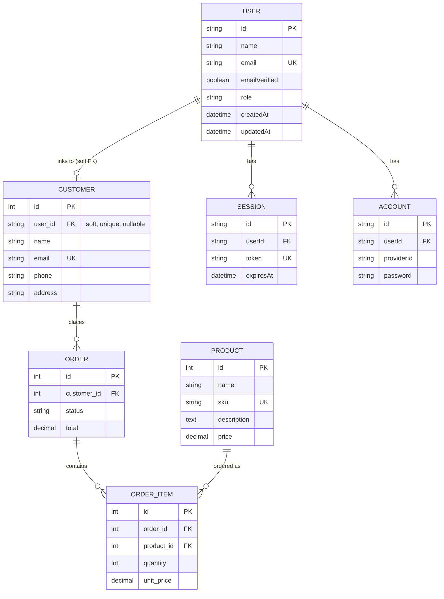

# Zion Industries — Laravel + Vue Demo

A simple app that demonstrates Vue UI components, a PHP API layer, and data persistence using SQLite. It's a small products/customers/orders system: manage a product catalog and customer list with full CRUD, place an order for a customer against one or more products, and track that order's status through its lifecycle — all behind email/password authentication with admin vs. customer roles.

## Technologies used

**Backend**
- [Laravel](https://laravel.com) 13 (PHP ^8.3) — API-only backend (`routes/api.php`), no server-rendered views
- SQLite — single-file database, zero server setup, shared between Laravel and the auth server
- Eloquent ORM, Form Request validation, API Resources, backed PHP enums (`OrderStatus`)
- [better-auth](https://better-auth.com) — email/password authentication, run as a small **Node/Express server** (`backend/auth-server.js`) alongside Laravel, since better-auth is JS-only

**Frontend**
- [Vue 3](https://vuejs.org) (Composition API, `<script setup>`) + [Vite](https://vitejs.dev)
- [Vue Router 4](https://router.vuejs.org) — client-side routing, with auth guards
- [Axios](https://axios-http.com) — API client
- [Tailwind CSS 4](https://tailwindcss.com) — utility-first styling
- `better-auth/vue` client for session state, sign-in/sign-up/sign-out

No UI component library, no state management library (Pinia) — each view fetches what it needs directly, and auth/modal state lives in a couple of small reactive singletons (`frontend/src/lib/`). This keeps the app small and easy to read end-to-end.

## Architecture

Three processes talk to each other, all proxied through one origin in development:

```
laravel-vue-demo/
├── backend/
│   ├── (Laravel)  API for products/customers/orders — :8000
│   └── (Node)     better-auth server — auth.js, auth-server.js — :3001
└── frontend/      Vue 3 + Vite SPA, consumes both — :5173
```

- **Laravel** exposes a REST API under `/api/*` (`routes/api.php`, registered via `bootstrap/app.php`). Controllers return `Http\Resources` classes so the JSON shape is explicit and decoupled from the database schema. Validation lives in `Http\Requests` classes, one per resource.
- **The Node auth server** runs better-auth (`backend/auth.js`) behind a one-route Express app (`backend/auth-server.js`), using Node's built-in `node:sqlite` pointed at the *same* SQLite file Laravel uses. It owns the `user`, `session`, `account`, and `verification` tables and everything under `/api/auth/*` (sign-up, sign-in, sign-out, session lookups — see [better-auth's docs](https://better-auth.com/docs) for the full endpoint list).
- **Laravel never issues its own sessions.** `App\Http\Middleware\BetterAuthSession` reads the better-auth session cookie on every API request and resolves it against the shared `session`/`user` tables (via two thin read-only models, `AuthUser` and `AuthSession`), attaching the logged-in user to the request. `RequireAuth` (aliased `auth.required`) enforces login where needed; admin-only actions check `$user->isAdmin()` directly in the controller.
- **Frontend** is a standalone SPA. In development, Vite proxies `/api/auth/*` to the Node server and everything else under `/api/*` to Laravel (`vite.config.js`) — both land on the same browser origin as the SPA, so cookies flow automatically with no CORS/credentials configuration needed anywhere.
- `npm run dev` in `backend/` starts **both** Laravel's Vite asset build and the Node auth server together (via `concurrently`) — it does not start `php artisan serve`, which still needs to run separately.

### Database schema

| Model | Notes |
|---|---|
| `Product` | name, sku, description, price. Browsable by anyone; only admins can create/edit/delete. |
| `Customer` | name, email, phone, address, nullable `user_id`. Admin-only — customers never see this section. |
| `Order` | belongs to a `Customer`; `status` cast to the `OrderStatus` enum; `total` computed and cached at creation time |
| `OrderItem` | belongs to an `Order` and a `Product`; snapshots `unit_price` at order time so historical totals stay correct even if a product's price changes later |
| `AuthUser` / `AuthSession` | read-only Eloquent views over better-auth's own `user`/`session` tables (non-incrementing string/cuid primary keys — see `$incrementing`/`$keyType` on both models) |

Order creation is wrapped in a DB transaction: an order and all its line items are created together, with the total computed server-side from live product prices — the client never sends a total.

Below is the full schema, spanning both Laravel's own tables (`product`, `customer`, `order`, `order_item`) and better-auth's tables (`user`, `session`, `account`) which live in the same SQLite file but are created/owned by the Node auth server, not a Laravel migration. `customer.user_id` is a **soft link** — Laravel can't declare a real foreign key into a table it doesn't manage, so it's enforced only at the application layer. better-auth also has a `verification` table (used for email/token verification flows) that isn't shown below since it has no relationship to any other table.



**How a login becomes a customer:** `Customer` isn't created at signup. The first time a non-admin places an order, Laravel finds-or-creates a `Customer` row matched by email and links it to that user's id (`OrderController::resolveOwnCustomer`) — an admin-created `Customer` with a matching email gets claimed rather than duplicated.

## Authentication & authorization

Email/password only, via better-auth. The login/signup modal (`frontend/src/components/AuthModal.vue`, login is the default mode) is triggered from the navbar's "Sign In" button or by visiting `/login`.

Every better-auth user has a `role`: `customer` (default) or `admin`. It's a custom `additionalFields` entry with `input: false`, so it can never be set by the client during signup — only by an operator, via:

```bash
php artisan auth:promote you@example.com
```

**Access rules:**

| Area | Guest | Customer (logged in) | Admin |
|---|---|---|---|
| Products — browse | ✅ | ✅ | ✅ |
| Products — create/edit/delete | ❌ | ❌ | ✅ |
| Customers | ❌ | ❌ | ✅ (full CRUD) |
| Orders — place | ❌ (login required) | ✅ (for themself only) | ✅ (for any customer) |
| Orders — view | ❌ | ✅ (own orders only) | ✅ (all orders) |
| Orders — update status / delete | ❌ | ❌ | ✅ |

These rules are enforced **server-side** in the controllers (`ProductController`, `CustomerController`, `OrderController`) — the frontend hiding a button is a UX nicety, not the actual boundary. A direct API call from a non-admin gets a `403`.

### Seeding an admin

A ready-made local admin account is seeded via a small Node script that goes through better-auth's own signup API (so the password is hashed the same way a real signup would be), then flips its role:

```bash
cd backend
npm run seed:admin
```

Creates (or, if it already exists, deletes and recreates so it always matches these constants — see `backend/seed-admin.js`):

```
zion.admin@zionindustries.com / ZionAdmin!
```

## Order status rules

`OrderStatus` (`pending → processing → shipped → completed`) only moves **forward** — `Cancelled` is reachable from any non-terminal status, but once an order is `completed` or `cancelled` it's terminal and can't be changed again. This is a real state machine on the enum (`App\Enums\OrderStatus::availableTransitions()`), enforced two places:

- **Server-side**, in `UpdateOrderStatusRequest` — the requested status must be in the current status's `availableTransitions()`, or the request 422s. This is the actual boundary; it can't be bypassed by calling the API directly.
- **Client-side**, the status dropdown on the order detail page only ever offers `order.available_statuses` (computed server-side and returned on the `OrderResource`) and disappears entirely once an order is terminal.

## API reference

All endpoints below are prefixed `/api` and served by Laravel (`routes/api.php`). `App\Http\Middleware\BetterAuthSession` resolves the session cookie on every request; `auth.required` (aliased to `RequireAuth`) enforces login where the table says so; admin checks happen inside the controller (`requireAdmin()`), not via route middleware. `/api/auth/*` (sign-up, sign-in, sign-out, session lookup, etc.) is handled separately by the better-auth Node server, not Laravel — see [better-auth's docs](https://better-auth.com/docs) for that endpoint list.

**Products** (`Api\ProductController`)

| Method | Endpoint | Auth | Description |
|---|---|---|---|
| GET | `/api/products` | Public | List products |
| GET | `/api/products/{id}` | Public | Show one product |
| POST | `/api/products` | Admin | Create a product |
| PUT/PATCH | `/api/products/{id}` | Admin | Update a product |
| DELETE | `/api/products/{id}` | Admin | Delete a product |

**Customers** (`Api\CustomerController`)

| Method | Endpoint | Auth | Description |
|---|---|---|---|
| GET | `/api/customers` | Admin | List customers |
| POST | `/api/customers` | Admin | Create a customer |
| GET | `/api/customers/{id}` | Admin | Show one customer |
| PUT/PATCH | `/api/customers/{id}` | Admin | Update a customer |
| DELETE | `/api/customers/{id}` | Admin | Delete a customer |

**Orders** (`Api\OrderController`)

| Method | Endpoint | Auth | Description |
|---|---|---|---|
| GET | `/api/orders` | Logged in | List orders (own orders for a customer, all orders for an admin) |
| POST | `/api/orders` | Logged in | Place an order (for self; an admin may specify `customer_id`) |
| GET | `/api/orders/{id}` | Logged in | Show one order (own only, unless admin) |
| PATCH | `/api/orders/{id}/status` | Admin | Advance the order's status (validated against `OrderStatus::availableTransitions()`) |
| DELETE | `/api/orders/{id}` | Admin | Delete an order |

There's no `PUT/PATCH /api/orders/{id}` for editing an order wholesale — status is the only thing that changes after creation, via the dedicated endpoint above (see [Order status rules](#order-status-rules)).

Request validation lives in `Http/Requests` and response shaping in `Http/Resources` (one of each per resource, see [Project structure](#project-structure)) — read those for exact field-level detail.

## Prerequisites

- PHP 8.3+ with the `sqlite3`/`pdo_sqlite` extensions enabled
- [Composer](https://getcomposer.org)
- Node.js 22+ (needs a stable built-in `node:sqlite`) and npm

## Getting started

```bash
# Backend — Laravel
cd backend
composer install
cp .env.example .env        # if not already present
php artisan key:generate
php artisan migrate --seed  # creates database/database.sqlite and seeds sample data
php artisan serve           # http://127.0.0.1:8000

# Backend — auth (in a second terminal, same backend/ directory)
npm install
# Add BETTER_AUTH_SECRET (32+ chars, e.g. `openssl rand -base64 32`) and
# BETTER_AUTH_URL=http://localhost:5173 to backend/.env if not already present
npx @better-auth/cli@latest migrate   # creates the user/session/account/verification tables
npm run dev                           # runs the auth server (:3001) + Laravel's Vite build
npm run seed:admin                    # seeds the admin login below

# Frontend (in a third terminal)
cd frontend
npm install
npm run dev                 # http://localhost:5173
```

Open `http://localhost:5173` and sign in with the seeded admin account to get full access (all orders, status updates, Customers section):

```
zion.admin@zionindustries.com / ZionAdmin!
```

The Vite dev server proxies `/api/auth/*` to the Node auth server and everything else under `/api` to the Laravel server automatically.

**Resetting the database:** `php artisan migrate:fresh --seed` drops *all* tables in the shared SQLite file, including better-auth's — re-run `npx @better-auth/cli@latest migrate` and `npm run seed:admin` afterward to get back to a fully working state.

⚠️ If the auth server (`node auth-server.js`) is already running when you do this, **restart it** afterward. Its `node:sqlite` connection is opened once at startup and doesn't see the tables being dropped and recreated out from under it by separate processes — it'll keep authenticating against the pre-reset admin user, which no longer exists as far as Laravel (or anything else with a fresh connection) is concerned. Symptom: sign-in appears to succeed, but every API call 401s. Fix: kill and restart `node auth-server.js` after any `migrate:fresh`.

## Project structure

```
backend/
├── app/
│   ├── Console/Commands/PromoteAdmin.php
│   ├── Enums/OrderStatus.php
│   ├── Http/Controllers/Api/     ProductController, CustomerController, OrderController
│   ├── Http/Middleware/          BetterAuthSession, RequireAuth
│   ├── Http/Requests/            per-resource Form Request validation
│   ├── Http/Resources/           per-resource API Resource (JSON shaping)
│   └── Models/                   Product, Customer, Order, OrderItem, AuthUser, AuthSession
├── database/
│   ├── migrations/
│   ├── factories/
│   └── seeders/DatabaseSeeder.php
├── auth.js          better-auth server config (role field, node:sqlite database)
├── auth-server.js   Express host for the better-auth handler
├── seed-admin.js    seeds/resets the local admin account
└── routes/api.php

frontend/
└── src/
    ├── api/          thin axios wrappers, one file per resource
    ├── components/   NavBar, StatusBadge, AuthModal
    ├── lib/          auth-client.js (better-auth/vue client), authModal.js (modal open/close state)
    ├── router/       route table + auth/admin guards
    └── views/        one folder per resource (products, customers, orders) + HomeView, LoginView
```

## Scope

This is a demo, not a production template — a few things are intentionally left out:

- No email verification, password reset, OAuth/social login, or 2FA — email/password only
- No inventory/stock tracking
- No queues, background jobs, or multi-tenancy
- The Node auth server and Laravel are only same-origin in development via the Vite proxy; a production deploy would need a shared reverse proxy in front of both
